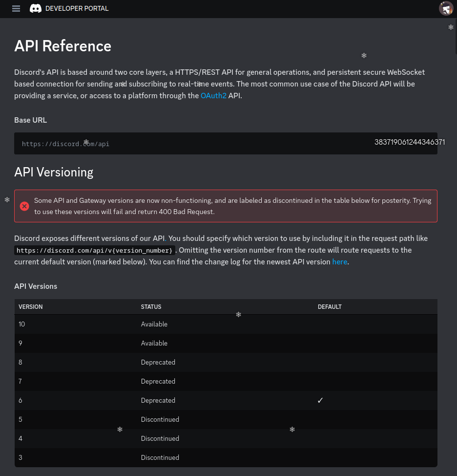

# A silly Discord easter egg I found

I run a small Discord server for my [programming twitch stream](https://twitch.tv/npmaile)(please watch it for tech stuff) and [one of my projects](https://github.com/npmaile/focusbot) made live on stream involves utilizing the Discord API. I went on the Discord api website today and was greeted with the following page


It's a totally normal page with an overlay of falling snowflakes, but one stood out to me.

"383719061244346371"

it's not a `*` like the rest.

## The hunt
My first thought was to just throw it into the URL bar, so I navigated to `https://discord.com/383719061244346371`

404 page not found

Dang. That wasn't it. 
My next thought was "is it a server or something? Can I finally join the Discord inner circle of master developers and bot creators? Can I join the hallowed ranks of [Mee6](https://mee6.xyz/en/) and the [owo counter bot](https://top.gg/bot/408785106942164992)?" 

Sadly, I have never seen an invite link that has a number like that in it, so that's not it.
It was a fun thought though!

But wait!
I'm on the bot developer page! They must have made a bot that will invite you to the inner circle!
Aha!

I grabbed my own bot's invite link and pasted the unique number in as the bot ID in my browser and excitely pressed enter

`unknown application`

DARN!

I was now determined to get to the bottom of this! Nothing could stop me from figuring this out! I went directly back to the source! not the page, but the inspector and searched for every occurance of that number on the page, and in the requests to Discord. 

```json
{
  "id": "383719061244346371",
  "username": "npmaile",
  "avatar": "4f47bcd0542ff479d0d1d822f7979dc3",
  "discriminator": "0",
  "public_flags": 0,
  "premium_type": 2,
  "flags": 48,
  "banner": "a_280c3d927a3e46fbb57a1f8441961e0a",
  "accent_color": 0,
  "global_name": "Nate",
  "avatar_decoration_data": null,
  "banner_color": "#000000",
  "mfa_enabled": true,
  "premium_usage_flags": 4,
  "linked_users": [],
  "bio": "https://npmaile.com",
}
```

It was my ID

My globally unique ID

My snowflake

Directly from Discord's own api documentation that I was already staring at:
```txt
Discord utilizes Twitter's snowflake format for uniquely identifiable descriptors (IDs). These IDs are guaranteed to be unique across all of Discord, except in some unique scenarios in which child objects share their parent's ID.
```

Well, so much for the inner circle...


update(16 hours after the original post): It turns out that it's obvious from a little admin panel for the overlay what the easter egg was. I'm just a little stupid sometimes. 
